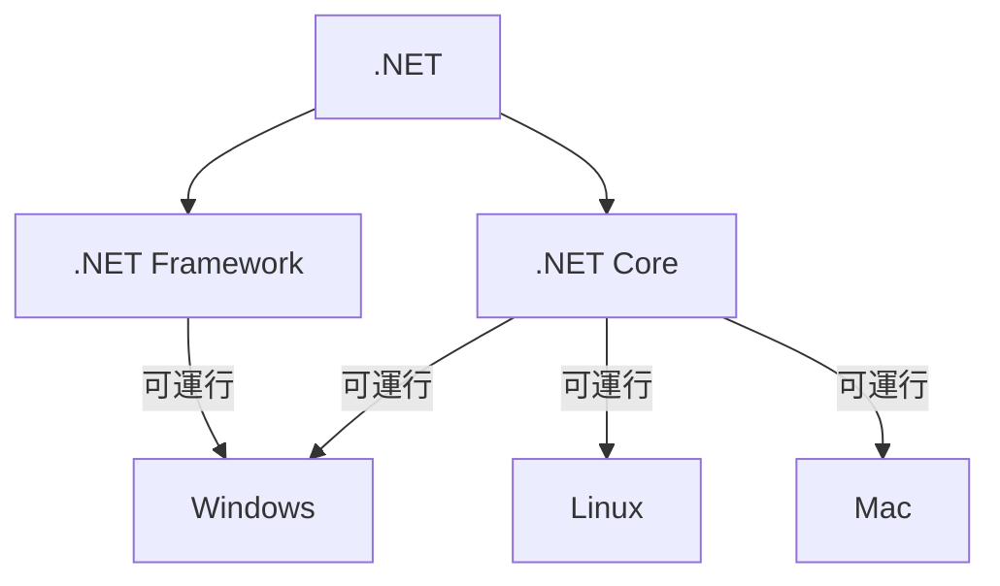
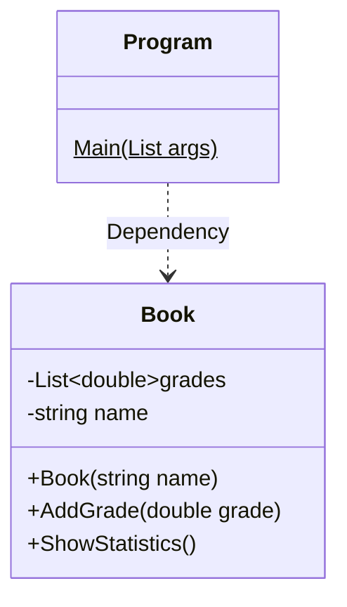

# GradeBook

This repository is for learning C# syntax and dotnet core runtime

## .NET

## 開發所需要安裝

1. .NET sdk
2. .NET runtime

## 架構

.NET 執行環境

CLR(Common Language Runtime)
FCL(Framework Core Library)

https://app.pluralsight.com/library/courses/csharp-fundamentals-dev/table-of-contents

## dotnet run 所執行的內容

1. 透過 dotnet restore 透過 nuget 下載該專案所需的 library

2. 執行 dotnet build 建立專案執行的 binary 到 bin 會產生 dll file

3. 透過 dotnet runtime 去執行 dll 

## 專案 class Diagram

